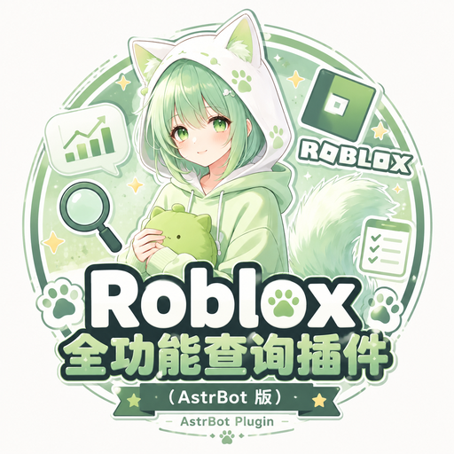

# Roblox 全功能查询插件（AstrBot 版）

用户 · 游戏 · 群组 · 好友粉丝关注 · 官方徽章 一站式查询

> ⚠️ **本插件目前处于测试阶段，可能会出现 bug，敬请谅解！**
> 部分功能依赖第三方数据源，上游接口随时可能变动失效；遇到问题欢迎提
> [Issue](https://github.com/xiaowan138/astrbot_plugin_roblox_search/issues) 反馈。

---

## 简介

一个 AstrBot 平台的 Roblox 综合查询插件，在群里发一句话就能查：

- **用户**：头像、3D 形象、在线状态、注册时长、好友/粉丝/关注数、官方徽章；官机使用带图片的原生 Markdown，OneBot 使用完整用户信息卡
- **游戏**：详情、在线人数、访问量、点赞收藏（兼容地点ID / 游戏ID 两种查询方式）
- **群组**：详情、成员数、职位列表、群主信息
- **社交**：好友列表（自动补全用户名、支持翻页）
- **绑定**：通过 Roblox 个人简介验证码绑定自己的账号，支持无参数快速查询

由 NoneBot2 插件 [nonebot_plugin_roblox_search](https://github.com/maoyyds-cn/nonebot_plugin_roblox_search)（v1.3.5，作者 MrMao）迁移并增强而来。

> 数据源为第三方代理 API（默认 `*.rotunnel.com`，非 Roblox 官方接口），域名可在配置中更换。

## 功能命令

| 命令 | 功能 |
|---|---|
| `/菜单`（别名 `/帮助` `/menu`） | 查看功能菜单（图片） |
| `/用户名搜索 [用户名]` | 查询用户资料、虚拟形象、在线状态、群组、好友/粉丝/关注数（精确匹配优先） |
| `/用户ID搜索 [数字ID]` | 按用户ID查询用户完整资料 |
| `/群组名搜索 [群组名]` | 模糊搜索群组并展示详情，附更多匹配候选 |
| `/群组ID搜索 [数字ID]` | 查询群组详情与职位列表 |
| `/游戏名搜索 [游戏名]` | OMNI Search 游戏名称搜索，查询在线人数、访问量、点赞数、类型 |
| `/游戏ID搜索 [数字ID]` | 查询游戏详情（同时兼容地点ID/游戏ID） |
| `/获取好友列表 [用户ID] [页码]` | 读取用户好友（每页 10 个，可翻页，自动补全用户名） |
| `/获取粉丝列表 [用户ID] [页码]` | 读取用户粉丝（当前数据源不可用，见注意事项） |
| `/获取关注列表 [用户ID] [页码]` | 读取用户关注（当前数据源不可用，见注意事项） |
| `/获取徽章列表 [用户ID]` | 读取用户获得的 Roblox 官方徽章 |
| `/绑定 [用户名]` | 生成简介验证码；不带参数时检测并完成绑定 |
| `/绑定ID [数字ID]` | 按用户 ID 生成简介验证码 |
| `/解绑` | 解除当前发送者的 Roblox 账号绑定 |
| `/查询` | 查询当前发送者已绑定的 Roblox 账号 |

示例：`/用户名搜索 Roblox`、`/获取好友列表 123456789 2`、`/游戏ID搜索 292439477`

所有命令也可不带 `/` 直接触发（如发送 `用户名搜索 Roblox`），可在配置中关闭。普通错误和参数提示使用纯文本；用户查询会按平台选择对应的输出方式。

**平台兼容**：同时兼容 **QQ 官方机器人（官机）** 与 **OneBot**（NapCat / Lagrange / LLOneBot 等）以及 Telegram、Discord 等其他 AstrBot 支持的平台。默认 `auto` 按每条消息来源自动适配：QQ 官机用户查询使用原生 Markdown，头像与 3D 虚拟形象嵌入双栏表格；OneBot 等平台优先生成一张 HTML 表格信息卡。官机的游戏查询仍使用带封面的原生 Markdown，其他平台在生图失败时回退到头像/形象图文链。

## 安装

1. 将本插件目录放入 AstrBot 的 `data/plugins/` 下（目录名保持 `astrbot_plugin_roblox_search`），或直接在 WebUI 上传打包的 zip。
2. 在 AstrBot WebUI 中启用插件，等待依赖自动安装（`httpx` / `pillow` / `python-dateutil`）。
3. 无需任何配置即可使用（白名单默认全开放）。

> 插件自带 Noto Sans SC 中文字体（`fonts/` 目录，OFL 开源协议），菜单图片在任何环境（包括无中文字体的 Docker 容器）都能正常渲染。

## 配置说明

在 AstrBot WebUI 的插件配置面板中可设置：

- **`search_white_list`**（群白名单，默认 `[]`）
  - 留空：所有群均可使用全部查询功能；
  - 填写群号列表：仅白名单内的群可使用查询功能（菜单始终可用），未授权群会收到提示；**私聊不受限制**。
- **`allow_no_slash_command`**（无斜杠触发开关，默认 `true`）
  - 开启后，直接发送「用户名搜索 Roblox」（不带 `/`）也可触发命令；
  - 关闭后仅支持 `/` 斜杠命令，避免普通聊天误触发。
- **`platform_type`**（平台类型，默认 `auto`）
  - `auto`：**按每条消息的来源平台自动识别**（推荐），同一个 AstrBot 同时接入 QQ 官方机器人 + OneBot 也无需手动切换，两边各自适配；
  - `onebot`：手动指定 OneBot（NapCat / Lagrange 等），用户查询优先发送包含头像与 3D 形象的单张表格卡；生图失败时才发送两张图片和文本；
  - `qq_official`：手动指定 QQ 官方机器人。用户查询始终使用原生 Markdown，头像和 3D 虚拟形象以双栏表格嵌入；游戏查询以原生 Markdown 嵌入游戏封面，并省略「正在查询...」中间提示。
- **`api_base_domain`**（数据源代理域名，默认 `rotunnel.com`）
  - 只填域名本身，不带 `https://` 和路径；
  - 默认代理不可用时可换 `roproxy.com` 或自建反代域名，无需改代码。
- **`qq_markdown_image_proxy`**（QQ 官方 Markdown 图片代理，默认 `https://wsrv.nl/`）
  - 官机 Markdown 里的 Roblox CDN 图片偶尔无法被 QQ 拉取，默认经图片代理转换为 PNG；
  - 留空则直接使用 Roblox CDN URL。若代理不可用但 QQ 可以直接显示 Roblox 图片，可设为空。
- **`enable_direct_binding`**（简介验证码绑定开关，默认 `true`）
  - 开启后使用 `/绑定 用户名` 或 `/绑定ID 用户ID` 获取验证码，把验证码放入对应 Roblox 账号简介后发送 `/绑定` 完成验证；
  - 绑定成功后可直接发送 `/查询`，也可以使用不带参数的 `/用户名搜索` 或 `/用户ID搜索`；
  - 关闭后绑定、解绑和无参数自查功能均不可用。
- **`query_cooldown`**（查询冷却秒数，默认 `5`，`0` = 不限制）
  - 同一群内同一用户两次查询的最小间隔，防止刷屏与触发接口限流（429）。

## 更新日志

### v1.9.0（2026-08-26）

**新增 Roblox 账号绑定：**
- 通过随机验证码写入 Roblox 个人简介完成所有权验证，不需要 Roblox 登录令牌；
- 新增 `/绑定`、`/绑定ID`、`/解绑`、`/查询` 命令；
- `/绑定` 不带参数时检测待验证简介，绑定成功后无参数用户查询会自动查询已绑定账号；
- 新增 `enable_direct_binding` 配置开关，可关闭直接绑定功能；
- 插件状态由“开发中”更新为“测试版”。

### v1.8.0（2026-08-26）

**用户资料表格化输出：**
- QQ 官方机器人保持原生 Markdown 输出，头像与 3D 虚拟形象使用双栏表格嵌入
- OneBot 等非官机平台使用真正的 HTML 双栏表格并渲染为单张图片
- 游戏资料标题下新增游戏封面 Markdown 图片，随后展示游戏统计、简介和 Roblox 链接
- 默认通过 `wsrv.nl` 代理 Roblox CDN 缩略图，提高 QQ 客户端显示成功率；可用 `qq_markdown_image_proxy` 配置切换或关闭
- QQ 官方机器人使用原生 Markdown；OneBot 与其他平台使用单张 HTML 信息卡主路径

> OneBot 等非官机平台的 HTML 用户卡由 AstrBot 渲染为单张图片；QQ 官方机器人则始终使用原生 Markdown 表格。

### v1.7.0（2026-08-26）

**统一完整信息卡输出：**
- 非官机用户查询默认生成单张深色信息卡；QQ 官方机器人使用原生 Markdown 档案格式
- 游戏查询默认生成单张游戏信息卡：游戏封面/图标、名称、开发者、在线人数、访问量、收藏/点赞数、类型、时间和简介在同一张图片中
- OneBot 与其他非官机平台优先使用 HTML 信息卡，QQ 官方机器人使用原生 Markdown
- 用户卡和游戏卡无图片 URL 时显示“暂不可用”占位区，而不是破图

### v1.6.0（2026-08-26）

**用户形象与游戏查询升级：**
- 官机用户查询补回 3D 虚拟形象：先独立发送虚拟形象图片，再发送原生 Markdown 用户资料卡；图片下载失败也不会影响资料卡输出
- 游戏名搜索从已下线的 `games/list` 切换到 Roblox OMNI Search，恢复按游戏名查询；候选会按名称相关性、在线人数、赞数等综合排序
- 游戏名搜索和游戏 ID 搜索统一输出：官机为原生 Markdown 游戏资料，OneBot 优先为单张 HTML 游戏信息卡，HTML 渲染失败自动回退为游戏图标 + 纯文本
- 游戏详情补充真实点赞数、Universe ID、地点 ID 和 Roblox 打开链接

> QQ 官方机器人中图片与原生 Markdown 无法置于同一条消息，所以官机用户形象与资料卡会分两条消息发送。

### v1.5.0（2026-08-26）

**官机原生 Markdown 用户资料：**
- QQ 官方机器人（`qq_official` / `qq_official_webhook`）的 `/用户名搜索` 与 `/用户ID搜索` 现在输出真正的 QQ 原生 Markdown（`msg_type=2`），不再发送普通图片+文本媒体消息
- 用户资料使用标题、加粗字段、代码样式 ID 与群组项目列表排版；用户名、简介、群组名等 Roblox 动态内容会转义，避免破坏 Markdown 格式
- 官机分支不再请求、下载或发送头像与虚拟形象图，避免 AstrBot 因 `Image` 组件把 Markdown 强制降级为 `msg_type=7` 富媒体消息
- OneBot 等非官机平台完全保留原有头像框 + 虚拟形象图 + 纯文本输出，不受影响

> QQ 官方机器人在当前 AstrBot 高层消息链中不能把图片与原生 Markdown 放在同一条消息；因此官机用户查询选择纯原生 Markdown，图片仅保留在 OneBot 输出中。

### v1.4.0（2026-08-22）

**修复：**
- `metadata.yaml` 的 `repo` 曾误指向原作者的 NoneBot 仓库，已改为本仓库（影响插件市场的仓库跳转与更新检查）
- 用户名搜索改为「精确匹配优先」：先走 `POST /v1/usernames/users`（稳定、约 1 秒），未命中再回退关键词搜索；同时搜索类接口改用短超时（10 秒）+ 单次尝试，避免此前高频词 504 时用户干等 30 秒以上
- 好友列表接口已不再返回用户名（Roblox 隐私改动，`name` 为空串导致每行显示“未知”），现在自动调用批量用户查询接口补全名字
- 注册时长计算的时区错误：Roblox 时间为 UTC，此前与本地 `datetime.now()` 直接对比导致最多 8 小时偏差，现在统一 UTC 计算并按本地时区展示日期
- 菜单页脚版本号不再硬编码，自动读取 `metadata.yaml`
- 菜单图片渲染（含 fc-list 字体探测子进程）移入线程池执行，不再阻塞事件循环；用户查询的两张图片改为并行下载

**新增：**
- `/获取徽章列表 [用户ID]`：查询用户获得的 Roblox 官方徽章
- 好友/粉丝/关注列表支持翻页：第 2 个参数为页码（每页 10 个）
- `api_base_domain` 配置项：数据源代理域名可配置（rotunnel.com / roproxy.com / 自建反代）
- `query_cooldown` 配置项：按「群+用户」维度的查询冷却，防刷防限流
- 游戏ID搜索的服务器列表改用详情返回的 `rootPlaceId` 查询（上游恢复后即可正确工作）
- 插件封面 `logo.png`（插件市场展示用）

**移除：**
- 用户资料中的“会员”字段：`users/{id}` 接口不返回 `isPremium`，会员验证接口需登录令牌，该字段从未显示过（改用徽章命令获取类似信息）

### v1.1.0 – v1.3.0（相对 NoneBot 原版的改进）

**修复的原插件 bug：**
- 群组名 / 游戏名搜索的关键词未做 URL 编码，中文或含空格的关键词会直接请求失败（原插件只有用户名搜索做了编码）
- 游戏 ID 查询不兼容 universeId 输入，现在两种 ID 都能查
- 同步 `requests` 在异步协程中调用会阻塞事件循环，改用 `httpx.AsyncClient`
- 未配置白名单时原版全部功能禁用，现在留空即全开放（装即用）
- 菜单图片在无中文字体的环境（Docker/Linux）显示方格子，现在插件自带字体
- 重复回复、接口参数错误、字体渲染等问题的修复（详见各版本提交）

**新增功能：**
- 用户查询增加认证徽章字段；游戏查询增加点赞数、类型字段；群组查询群主附带 ID
- 群组名 / 游戏名搜索展示更多匹配候选（前 3 个），方便继续用 ID 命令查详情
- 输出长度保护（超长自动截断），适配各平台消息长度限制
- 输出格式重新设计：纯文本 + 中文标点排版，不含 `|`、`*`、`#` 等 Markdown 敏感字符

## 注意事项

- 依赖可访问数据源代理域名（默认 `*.rotunnel.com`）的网络环境；代理不可用时可修改 `api_base_domain` 配置切换。
- 好友 / 粉丝 / 关注、在线状态等接口偶尔可能被限流（429），插件已内置自动重试与退避，以及按「群+用户」的查询冷却（`query_cooldown`）。
- **第三方代理接口可能随时变化**（2026-08-22 实测）：
  - 游戏名搜索（`games/list`）已被 Roblox 上游下线（404），命令保留但会提示不可用，建议到 roblox.com 网页搜索获取游戏ID后用 `/游戏ID搜索`；
  - 公开服务器列表（`servers/Public`）已被 Roblox 上游禁用（403），`/游戏ID搜索` 的服务器部分当前恒为空；
  - 粉丝/关注列表接口需要登录令牌（401），`/获取粉丝列表`、`/获取关注列表` 当前会提示无数据；
  - 用户名关键词搜索对高频词会 504，插件已改为精确匹配优先 + 短超时快速失败；
  - 好友列表接口不再返回用户名，插件已自动批量补全；
  - 其余接口（用户详情、群组、缩略图、徽章、数量统计等）实测正常。
  - 以上为上游 Roblox 侧的改动，更换代理域名无法恢复；若某功能突然不可用，可先观察是否为代理临时故障。
- `fonts/` 目录内的 Noto Sans SC 字体遵循 [OFL 开源协议](fonts/OFL-LICENSE.txt)，可自由使用与再分发。
- 本项目仅供学习交流，请遵守 Roblox 与相关 API 的使用条款。

## 贡献者

- [MrMao](https://github.com/maoyyds-cn) —— 原 NoneBot2 插件 [nonebot_plugin_roblox_search](https://github.com/maoyyds-cn/nonebot_plugin_roblox_search) 作者
- [xiaowan138](https://github.com/xiaowan138) —— AstrBot 迁移与功能增强维护
